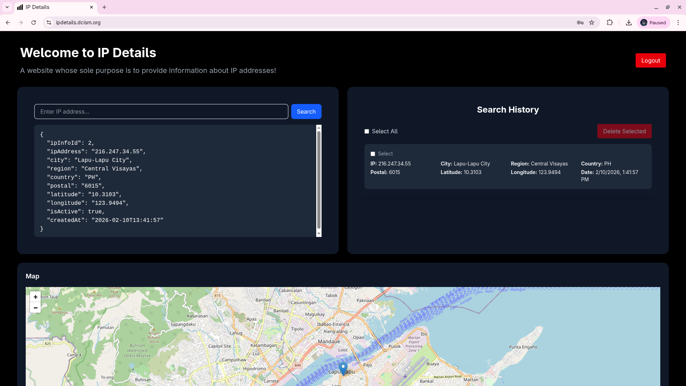
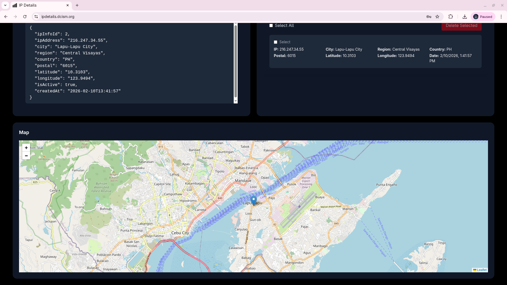
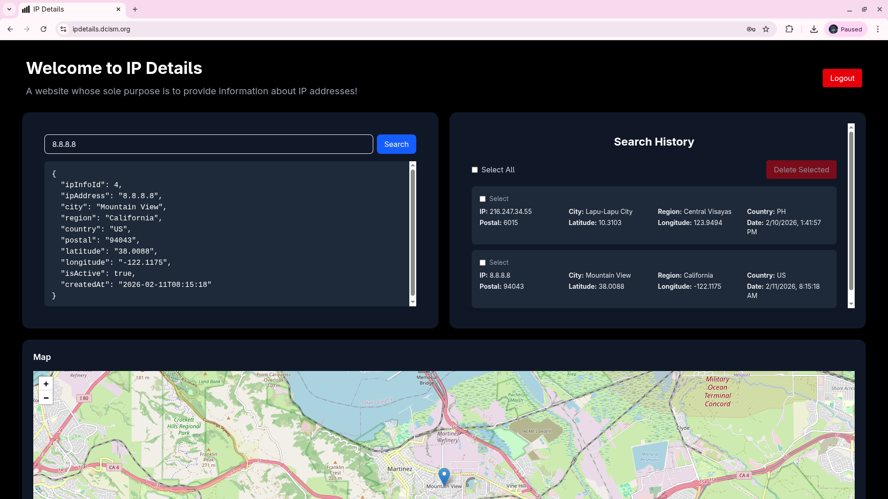
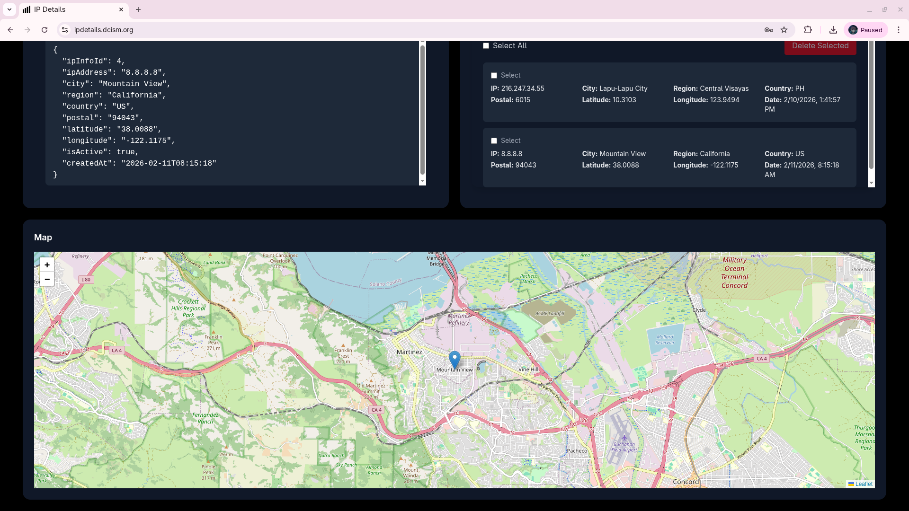
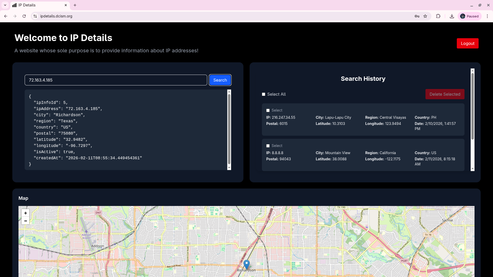
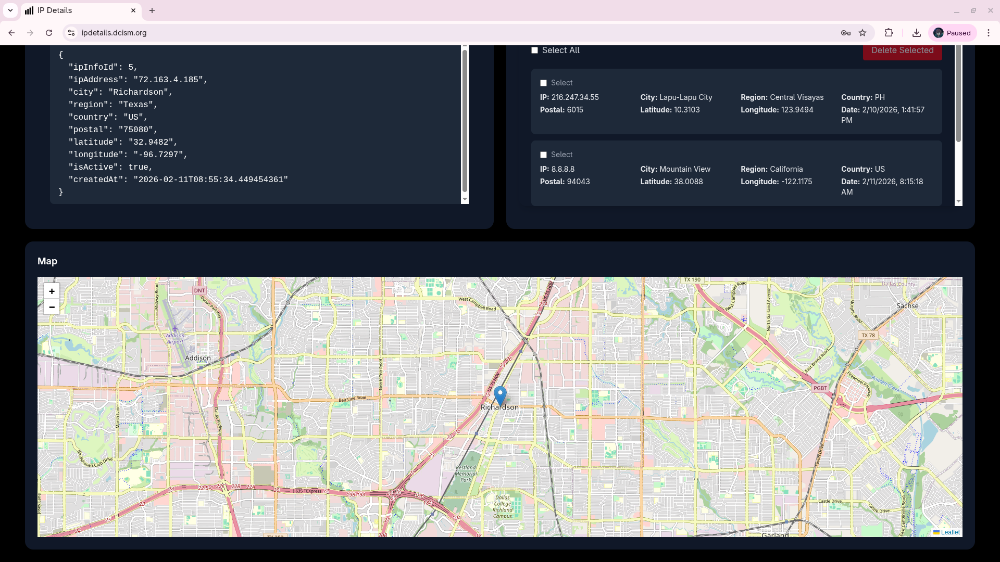
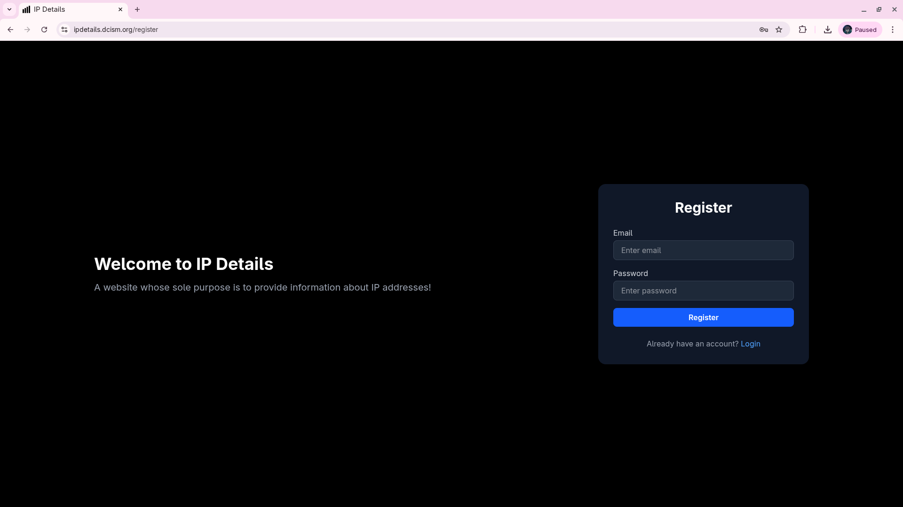

# IP Info Web

This project is a Vite powered static website that serves as the frontend of IP Info API.
<br/>
<br/>
You can access the website at https://ipdetails.dcism.org/

## Requirements

- Node.js - `v22.22.0`
- npm - `10.9.4`

## Running the Project

This repository has been setup specifically for local testing. So all you should do is run:

```bash
npm run dev
```

from the root directory.
<br><br>
This command will:

- Run the web service and should automatically connect to the API if it is already running

Once running, the web service will be accessible at:

```
http://localhost:5173
```

These credentials are intended for local testing only.

## User Accounts

- In the API itself there are three user accounts that have been seeded. These are
  - test@example.com
  - admin@example.com
  - user@example.com
- All three accounts share the same password `password123`

## Issues that you might encounter

- You encounter any CORS-related issues, head on over to the API project, specifically `src/main/java/com/georgesalise/apiRepo/config/CorsConfig.java` and add the origins used by the frontend. There's a comment I left there telling you where to put it. This can happen if the frontend uses a different port that what is being used for this web service, which is `5173`.
- When running the dockerized project with the frontend, you might see this error message:

```
not-null property references a null or transient value for entity com.georgesalise.apiRepo.api.model.IPInfo.city
```

- This happens because both the frontend and backend are running locally. The backend, running inside a Docker container, sees requests coming from the Docker bridge network IP (typically `172.18.0.1`), which is a <b>private IP address in the `172.16.0.0/12` range</b>. IP geolocation services cannot provide location data (city, country, etc.) for private IP addresses, resulting in `null` values that violate the database's `NOT NULL` constraint on the `city` field.

## Notes

- On the live website itself, you may encounter some issues, such as being unable to make a search for an IP address
- This primarly because the server that the API is being hosted on has trouble reaching the the API used for fetching the IP information.
- This occurence is common at night (UTC+08:00). Thus, it is recommended that the website is accessed in the morning.

## Images

### Home Page - currently showing the user's IP information




### Home Page - currently showing the queried IP's information






### Log In Page


### Register Page



## Closing remarks

I had a lot of fun making this project, it helped me strengthen my skills in web development and also because I was working on a topic that's close to my area of expertise which is networking.
